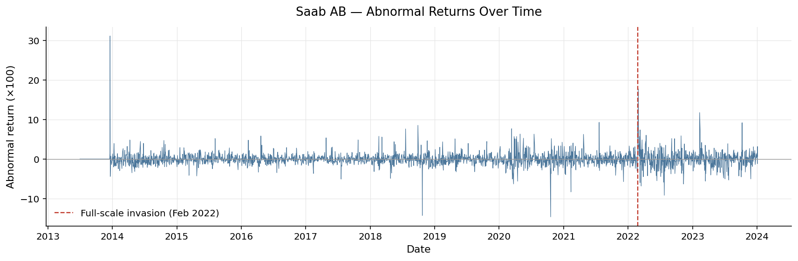
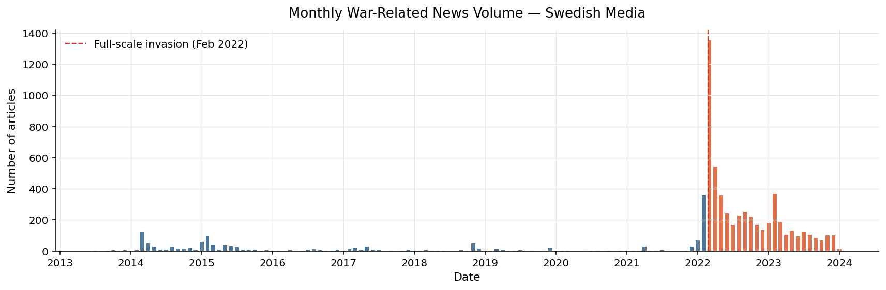

# War-related news coverage and stock-market behaviour: A case study of Saab AB

Master thesis, Applied Economics and Data Analysis, Jönköping University, 2026.
Luca Masciavè & Bruno Román Martínez.

This repository contains the **data-construction and analysis code**. It studies whether
domestic war-related news coverage (volume and tone) is associated with abnormal returns
of Saab AB, using calendar-aware news alignment, rolling-window abnormal returns, OLS with
HAC errors, Granger causality tests and an AR(2)-X EGARCH(1,1) model.

**Main findings (associations, not causal estimates)**
- More war-related coverage is associated with higher Saab abnormal returns, across every specification.
- Neutral and positive coverage lifts returns; negative coverage shows no significant effect (10% level).
- The relationship is specific to the defence firm: it does not appear in non-defence firms or in a bank placebo.
- Coverage moves the level of returns, barely their volatility.




## Pipeline

```
articles (not shared) --> data_pipeline.py --> daily panel --> analysis.py --> results/
```

| Step | File | What it does |
|---|---|---|
| 1 | `data_pipeline.py` | Assigns each article to a trading session using the Stockholm exchange calendar (half-days, after-close and weekend/holiday rules), aggregates daily news features, downloads market data, builds rolling market-model abnormal returns for Saab and eight Swedish peers |
| 2 | `analysis.py` | OLS with HAC errors (VIF, Breusch-Pagan), Granger causality in both directions, AR(2)-X EGARCH(1,1) with Student-t errors |

## Quick start

```bash
git clone <this-repo>
cd <this-repo>
pip install -r requirements.txt

python data_pipeline.py --news news.xlsx --saab-news saab_news.xlsx --out data/dataset.xlsx
python analysis.py --data data/dataset.xlsx --out results
```

## What is and is not included

| Included | Not included |
|---|---|
| Calendar alignment, feature and abnormal-return construction | Article headlines and text |
| OLS, Granger and EGARCH models and diagnostics | Names of the media sources |
| Figures | The raw news collection and filtering step |
| Expected input columns (below) | The sentiment-scoring step applied to articles |

The news comes from a source-protected archive, so collection, filtering and text scoring
are intentionally left out. The pipeline starts from two spreadsheets you supply:

- `--news`: one row per article with `date`, `time`, `sentiment_score`
- `--saab-news`: one row per Saab-specific article with `date` (full timestamp)

The panel, placebo, tone-split and EGARCH-X results in the thesis are not yet reproduced by
the scripts in this repository.

## Design notes

- **No look-ahead in the news alignment.** An article published at or after the day's actual
  close (or on a weekend/holiday) is assigned to the next session.
- **No look-ahead in abnormal returns.** Alpha and beta for day *t* use only days *t-120 ... t-1*.
- **Contemporaneous controls.** Controls (S&P 500, MSCI World proxy, VIX, Brent, FX, market
  activity) are same-calendar-day values. US-listed series close after Stockholm does, so the
  models are read as same-day associations, not forecasts. Timing is tested explicitly only in
  the Granger tests.
- **Days without coverage** have zero counts and a neutral (0) average sentiment.

## Input columns expected by `analysis.py`

`trading_date`, `abn_ret_saab` (decimal), `news_count`, `saab_news_count`, `avg_sentiment`,
`vix_level`, `ret_brent`, `ret_eursek`, `ret_msci`, `swe_mkt_activity`, `after_payday`, `EPU`,
`10_year_bond_y`.

`after_payday`, `EPU` and `10_year_bond_y` are not produced by `data_pipeline.py`; they are
merged in from external sources.

## Limitations

Single firm, single conflict, no causal identification. Returns also predict later news
volume (lags 3-5), so the relationship runs in both directions. Sentiment measures polarity,
not threat versus solidarity framing.
